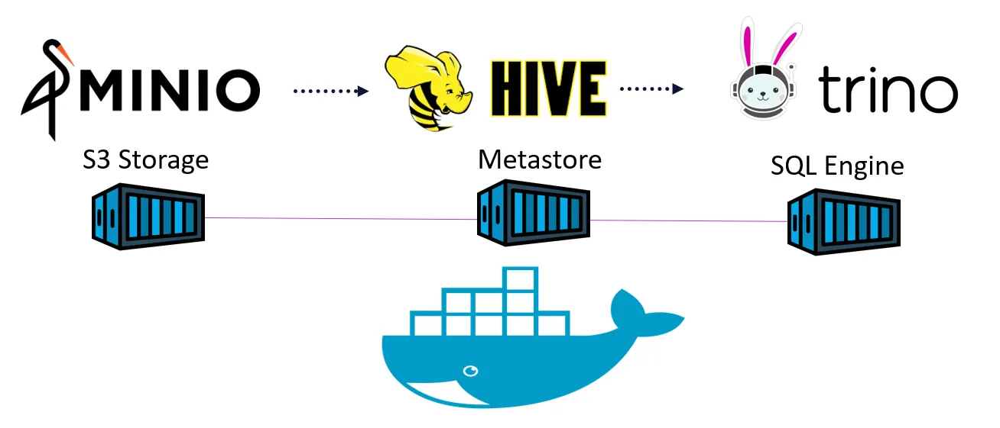

### Introduction

Data Warehouses have been state of the art for analytic workloads since the 1980's with the emergence of Ralph Kimball's dimensional modeling. These were built to aggreagte structured data from different sources and run analytic queries on them to generate insights.

Up until the emergence of cloud dwh's like Aws Redshift most data warehouses had stoarge and compute tightly coupled together. This made scaling inflexible since you could not independently scale storage from compute and vice versa.

In general, Data Warehouses however are quite expensive and do not support unstructured data. Moreover they are not suited for advanced analytic workloads. Data Warehouses are also a single locked system, which means your data can just be accessed by the compute engine of the warehouse.

__Data Lakes__

These drawbacks have been adressed by Data Lakes. They offer cheap storage and flexibility with data format and file type. In addition to that, they can be accessed by a wide variety of computational engines.

Individual datasets within data lakes are often organized as collections of files within directory structures, often with multiple files in one directory representing a single table. The benefits of this approach are that data is highly accessible and flexible.
However, several concepts provided by traditional databases and data warehouses are not addressed solely by directories of files and require additional tooling. This includes:

- What is the schema of a dataset, including columns and data types
- Which files comprise the dataset and how are they organized (e.g., partitions)
- How different applications coordinate changes to the dataset, including both changes to the definition of the dataset and changes to data
- Making transactions ACID compliant
- Enabling, Inserts, merges and timetravel etc.

A solution are __Data Lakehouse__

Data Lakehouses still use the cheap and flexible storage of Data Lakes, but they add a layer of structure and governance to the data. They use open table formats like Apache Iceberg to provide schema enforcement, organization of files, and other traditional database-like features.

This enables Data Lakehouses to use traditional SQL-based tools and techniques to query and analyze the data, which makes it easier for both business analysts and data scientists to work with the data and find insights.

By combining the best aspects of Data Lakes and traditional Data Warehouses, Data Lakehouses provide a way to store and manage data that is both flexible and structured. This makes it easier for teams to collaborate, find insights, and make informed decisions.

In this repository I have built a sample Lakehouse architecture, deployed via Docker compose. It can be used for local testing purposes or as a backend to your own data analysis projects, as a more real-life like solution compared to files on your own disk.

### Architecture of this lakehouse:



**Storage:**

As for the storage layer, Minio is an open source, S3 compliant Object storage. Such a storage has less operational cost than a traditional data warehouses and enables us to store all types of data and formats. Moreover since it is decoupled from our query engine we can scale it independently, if we need additional storage but not more processing power.

**Table formats**

Table formats are a way to organize data files. They try to bring database-like features to the Data lake. This is one of the key differences between a Data Lake and Lakehouse.

**Schema Metastore**

The schemas, partitions and other metadata of the created tables needs to be stored in a central repository. This is what we use the Hive Metastore for. It consists of a Thrift Server and a relational database in the backend. In this case I have chosen MariaDB.
The Hadoop Version used for this setup is `hadoop-3.3.6`.

**Query engine**

Trino is a Query engine which lets you create and query tables based on flat files via. Moreover it support query federation, meaning you can join data from multiple different sources. Like all other services, Trino has been deployed in a Docker container.

Trino itself works like a massively parallel processing databases query engine, meaning it scales verticaly instead of increasing processing power of one node. Moreover it is a connector based architecture. As explained before Trino itself is only a query engine, thus relying on connectors to connect to all types of data sources. A database on the other hand has both the query engine and storage coupled together. The connector will translate the Sql statement to a set of API calls which will return so called pages: A collection of rows in columnar format. The users Sql query will be translated into a query or execution plan on the data. Such a plan consists of multiple stages that process these pages and which will be assigned to the worker nodes by the coordinator.

There is a really good explanation on it in the O'Reilly Trino book, which can be found [here](https://www.oreilly.com/library/view/trino-the-definitive/9781098107703/ch04.html#fig-task-split)

In this project the computational service (Trino) is decoupled from the storage and thus would allow for easy scalability independent of the data storage.

### How to deploy it locally

The first step is to build the `custom-hive-metastore` Docker image by running `docker build -t custom-hive-metastore .` in the root of the project before Docker Compose.

To run this project on your machine, you have to clone it and simply run a

```bash
docker compose up -d
```

Small tweaks are required to get this running on a Mac M1+, mainly in the building of the `custom-hive-metastore` file via the `docker build --platform linux/x86 -t custom-hive-metastore .` command to match architecture.
